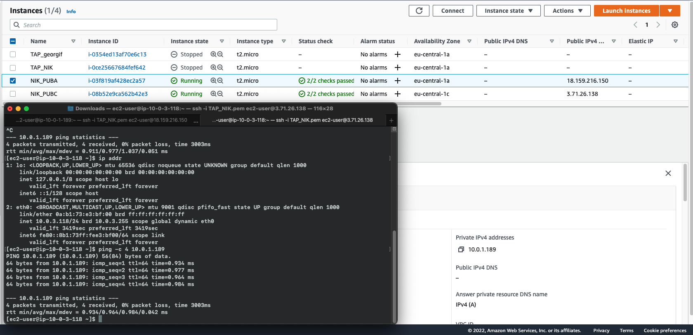
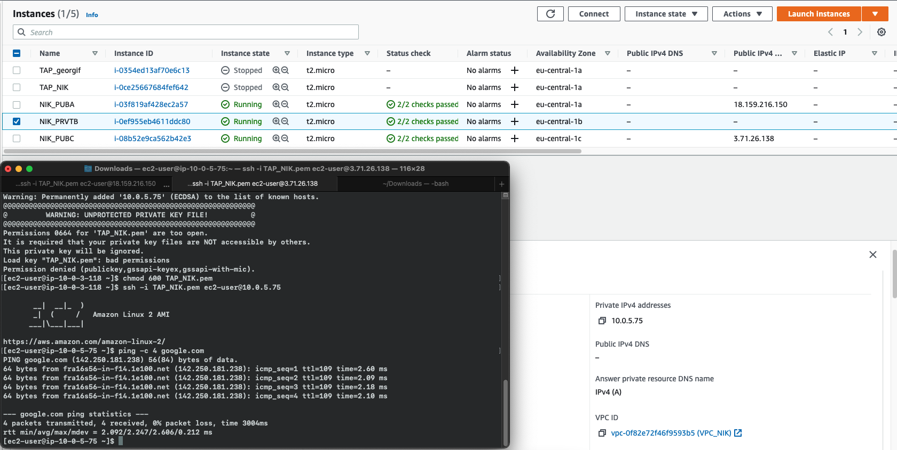
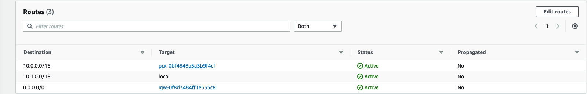
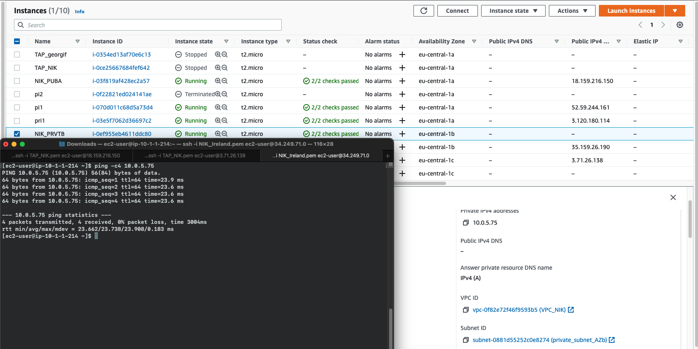

## 1.  Create VPC with address 10.0.0.0/16
```
aws ec2 create-vpc --cidr-block 10.0.0.0/16 \
--tag-specifications ResourceType=vpc,Tags='[{Key=Name,Value=VPC_NIK}]' \
--region eu-central-1
"VpcId": "vpc-0f82e72f46f9593b5"
```
## 2. Create Internet gateway and attach it the VPC
```
aws ec2 create-internet-gateway \
    --tag-specifications ResourceType=internet-gateway,Tags='[{Key=Name,Value=IGW_NIK}]' \
    --region eu-central-1
"InternetGatewayId": "igw-0ce30fe0e0231289c"
```
```
aws ec2 attach-internet-gateway \
    --internet-gateway-id igw-0ce30fe0e0231289c \
    --vpc-id vpc-0f82e72f46f9593b5 \
    --region eu-central-1
```
## 3. Create 3 public subnets
```
aws ec2 create-subnet \
    --vpc-id vpc-0f82e72f46f9593b5 \
    --cidr-block 10.0.1.0/24 \
    --availability-zone eu-central-1a \
    --tag-specifications ResourceType=subnet,Tags='[{Key=Name,Value=public_subnet_AZa}]' \
    --region eu-central-1
"SubnetId": "subnet-0bdcd34132b2878cd"

aws ec2 create-subnet \
    --vpc-id vpc-0f82e72f46f9593b5 \
    --cidr-block 10.0.2.0/24 \
    --availability-zone eu-central-1b \
    --tag-specifications ResourceType=subnet,Tags='[{Key=Name,Value=public_subnet_AZb}]' \
    --region eu-central-1
"SubnetId": "subnet-01085e17d67cb8630"

aws ec2 create-subnet \
    --vpc-id vpc-0f82e72f46f9593b5 \
    --cidr-block 10.0.3.0/24 \
    --availability-zone eu-central-1c \
    --tag-specifications ResourceType=subnet,Tags='[{Key=Name,Value=public_subnet_AZc}]' \
    --region eu-central-1
"SubnetId": "subnet-07dc9eddfc37204fe"
```
## 4. Create new routing table and route for the new public subnets
```
aws ec2 create-route-table --vpc-id vpc-0f82e72f46f9593b5 \
    --tag-specifications ResourceType=route-table,Tags='[{Key=Name,Value=public_routetable}]' \
    --region eu-central-1
"RouteTableId": "rtb-03866cbbcdb5d5f26"

aws ec2 create-route --route-table-id rtb-03866cbbcdb5d5f26 \
    --destination-cidr-block 0.0.0.0/0 \
    --gateway-id igw-0ce30fe0e0231289c \
    --region eu-central-1
```
## 5. Associate the routing table with subnets:
```
aws ec2 associate-route-table \
    --route-table-id rtb-03866cbbcdb5d5f26 \
    --subnet-id subnet-0bdcd34132b2878cd \
    --region eu-central-1

aws ec2 associate-route-table \
    --route-table-id rtb-03866cbbcdb5d5f26 \
    --subnet-id subnet-01085e17d67cb8630 \
    --region eu-central-1

aws ec2 associate-route-table \
    --route-table-id rtb-03866cbbcdb5d5f26 \
    --subnet-id subnet-07dc9eddfc37204fe \
    --region eu-central-1
```
## 6. Enable auto assign public IP for these 3 subnets
```
aws ec2 modify-subnet-attribute --subnet-id subnet-0bdcd34132b2878cd --map-public-ip-on-launch --region eu-central-1
aws ec2 modify-subnet-attribute --subnet-id subnet-01085e17d67cb8630 --map-public-ip-on-launch --region eu-central-1
aws ec2 modify-subnet-attribute --subnet-id subnet-07dc9eddfc37204fe --map-public-ip-on-launch --region eu-central-1
```


## 7. Create private subnets, routing table which will use NAT
```
aws ec2 create-subnet \
    --vpc-id vpc-0f82e72f46f9593b5 \
    --cidr-block 10.0.4.0/24 \
    --availability-zone eu-central-1a \
    --tag-specifications ResourceType=subnet,Tags='[{Key=Name,Value=private_subnet_AZa}]' \
    --region eu-central-1
"SubnetId": "subnet-024a372f662381b50"

aws ec2 create-subnet \
    --vpc-id vpc-0f82e72f46f9593b5 \
    --cidr-block 10.0.5.0/24 \
    --availability-zone eu-central-1b \
    --tag-specifications ResourceType=subnet,Tags='[{Key=Name,Value=private_subnet_AZb}]' \
    --region eu-central-1
SubnetId": "subnet-0881d55252c0e8274"

aws ec2 create-subnet \
    --vpc-id vpc-0f82e72f46f9593b5 \
    --cidr-block 10.0.6.0/24 \
    --availability-zone eu-central-1c \
    --tag-specifications ResourceType=subnet,Tags='[{Key=Name,Value=private_subnet_AZc}]' \
    --region eu-central-1
SubnetId": "subnet-085adc39e627e7a4c

aws ec2 create-route-table --vpc-id vpc-0f82e72f46f9593b5 \
    --tag-specifications ResourceType=route-table,Tags='[{Key=Name,Value=nat_routetable}]' \
    --region eu-central-1
RouteTableId": "rtb-06499f3bbdaa4f8af
```
## 8. Allocate IP address that will be used for the NAT
```
aws ec2 allocate-address --tag-specifications ResourceType=elastic-ip,Tags='[{Key=Name,Value=nat_routetable}]' \
    --region eu-central-1
"AllocationId": "eipalloc-06a788cb59c42cc28
"PublicIp": "3.66.71.7"
```
## 9. Create the NAT gateway
```
aws ec2 create-nat-gateway \
    --subnet-id subnet-0bdcd34132b2878cd \
    --allocation-id eipalloc-06a788cb59c42cc28 \
    --region eu-central-1 \
    --tag-specifications ResourceType=natgateway,Tags='[{Key=Name,Value=nat_nik}]'
NatGatewayId": "nat-0919792f32183ea3c
```
## 10. Create the route for the NAT and associate route table with each subnet
```
aws ec2 create-route --route-table-id rtb-06499f3bbdaa4f8af \
    --destination-cidr-block 0.0.0.0/0 \
    --gateway-id nat-0919792f32183ea3c \
    --region eu-central-1


aws ec2 associate-route-table \
    --route-table-id rtb-06499f3bbdaa4f8af \
    --subnet-id subnet-024a372f662381b50 \
    --region eu-central-1

aws ec2 associate-route-table \
    --route-table-id rtb-06499f3bbdaa4f8af \
    --subnet-id subnet-0881d55252c0e8274 \
    --region eu-central-1

aws ec2 associate-route-table \
    --route-table-id rtb-06499f3bbdaa4f8af \
    --subnet-id subnet-085adc39e627e7a4c \
    --region eu-central-1
```

## 11. Create privete subnets for the database and associate them to the default route table
```
aws ec2 create-subnet \
    --vpc-id vpc-0f82e72f46f9593b5 \
    --cidr-block 10.0.7.0/24 \
    --availability-zone eu-central-1a \
    --tag-specifications ResourceType=subnet,Tags='[{Key=Name,Value=database_subnet_AZa}]' \
    --region eu-central-1
"SubnetId": "subnet-02db0abd422aff62b

aws ec2 create-subnet \
    --vpc-id vpc-0f82e72f46f9593b5 \
    --cidr-block 10.0.8.0/24 \
    --availability-zone eu-central-1b \
    --tag-specifications ResourceType=subnet,Tags='[{Key=Name,Value=database_subnet_AZb}]' \
    --region eu-central-1
SubnetId": "subnet-0f76d61456f4bd2f9

aws ec2 create-subnet \
    --vpc-id vpc-0f82e72f46f9593b5 \
    --cidr-block 10.0.9.0/24 \
    --availability-zone eu-central-1c \
    --tag-specifications ResourceType=subnet,Tags='[{Key=Name,Value=database_subnet_AZc}]' \
    --region eu-central-1
SubnetId": "subnet-02887a6677a749173

aws ec2 associate-route-table \
    --route-table-id rtb-0caec0e19945fdccc \
    --subnet-id subnet-02db0abd422aff62b \
    --region eu-central-1

aws ec2 associate-route-table \
    --route-table-id rtb-0caec0e19945fdccc \
    --subnet-id subnet-0f76d61456f4bd2f9 \
    --region eu-central-1

aws ec2 associate-route-table \
    --route-table-id rtb-0caec0e19945fdccc \
    --subnet-id subnet-02887a6677a749173 \
    --region eu-central-1
```
## 12. Edit the security group to enable port 22 for all addresses.
```
aws ec2 authorize-security-group-ingress \
    --group-id sg-07d62022dd91d1566 \
    --protocol tcp \
    --port 22 \
    --cidr 0.0.0.0/0 \
    --region eu-central-1
```

## 13. Below are ping tests:
### Create 2 t2.micro EC2 instances in 2 different public subnets and SSH to each EC2 instance and ping the other:

### Create the third t2.micro EC2 instance in a private subnet and connect SSH to the instance and ping google.com


## VPC Peering
### 1. First created VPC in Ireland region with network 10.1.0.0/16
### 2. Created new Peering connection between the VPC in Ireland(10.1.0.0/16) and the one in Frankfurt(10.0.0.0/16)
### 3. Create new subnet and route table with Internet gateway and route for the network in Frankfurt

### 4. We edit all route tables in Frankfurt to include the route for the Ireland VPC network(10.1.0.0/16)
### 5. Finally edit security groups for both VPC to enable inbound traffic for each network.
### 6. Ping test from EC2 instance in Ireland VPC to the the EC2 instance in Frankfurt.
