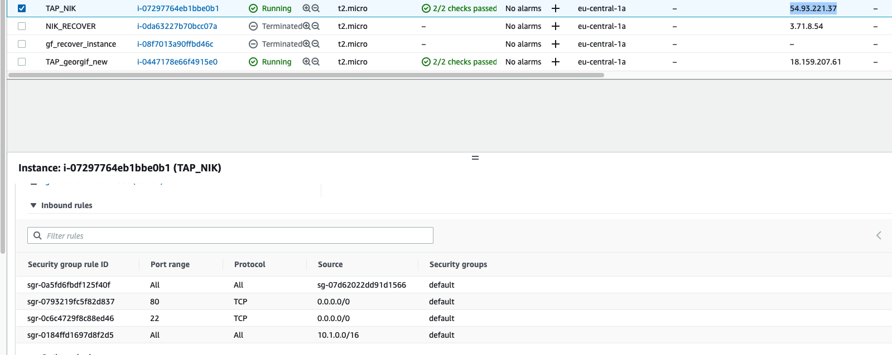
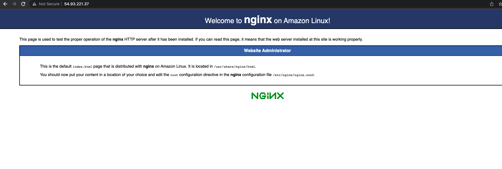
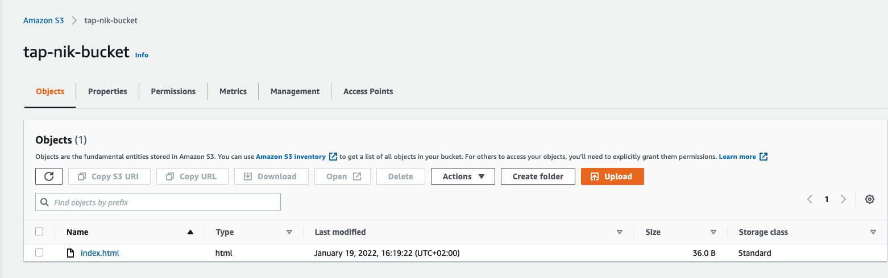

## 1. Deleted the authorized_keys from the EC2 instance:
```bash
       __|  __|_  )
       _|  (     /   Amazon Linux 2 AMI
      ___|\___|___|

https://aws.amazon.com/amazon-linux-2/
[ec2-user@ip-10-0-1-97 ~]$ cd .ssh/
[ec2-user@ip-10-0-1-97 .ssh]$ ls
authorized_keys
[ec2-user@ip-10-0-1-97 .ssh]$ rm authorized_keys 
[ec2-user@ip-10-0-1-97 .ssh]$ 
```
## 2. Stop the instance and detach the volume.
## 3. Create new instance and attach the volume. We can see the new volume:
```bash
[ec2-user@ip-10-0-1-177 ~]$ lsblk
NAME    MAJ:MIN RM SIZE RO TYPE MOUNTPOINT
xvda    202:0    0   8G  0 disk 
└─xvda1 202:1    0   8G  0 part /
xvdf    202:80   0   8G  0 disk 
└─xvdf1 202:81   0   8G  0 part 
```
## 4. Mount the partition and create the new authorized_keys:
```bash
[ec2-user@ip-10-0-1-177 ~]$ sudo mount -o nouuid /dev/xvdf1 /home/ec2-user/recovery
[ec2-user@ip-10-0-1-177 ~]$ cd /home/ec2-user/recovery/home/ec2-user/.ssh/
[ec2-user@ip-10-0-1-177 .ssh]$ ls -la authorized_keys 
-rw------- 1 ec2-user ec2-user 390 Jan 19 10:28 authorized_keys
```
## 5. Unmount the partition:
```bash
[ec2-user@ip-10-0-1-177 ~]$ sudo umount /home/ec2-user/recovery
[ec2-user@ip-10-0-1-177 ~]$ lsblk
NAME    MAJ:MIN RM SIZE RO TYPE MOUNTPOINT
xvda    202:0    0   8G  0 disk 
└─xvda1 202:1    0   8G  0 part /
xvdf    202:80   0   8G  0 disk 
└─xvdf1 202:81   0   8G  0 part 
```
## 6. From AWS console we detach the volume and attach it back to initial EC2 instance with name /dev/xvda.
## 7. Start the EC2 instance and ssh into it:
```bash
nikolayninov@Nikolays-MBP:~/Downloads$ ssh -i TAP_NIK.pem ec2-user@54.93.221.37

       __|  __|_  )
       _|  (     /   Amazon Linux 2 AMI
      ___|\___|___|

https://aws.amazon.com/amazon-linux-2/
[ec2-user@ip-10-0-1-97 ~]$ ls -la .ssh/authorized_keys 
-rw------- 1 ec2-user ec2-user 389 Jan 19 11:01 .ssh/authorized_keys
```

# Connect using session manager
## 1. First we verify that we have ssm-agent installed on our instance:
```bash
[ec2-user@ip-10-0-1-97 ~]$ sudo systemctl status amazon-ssm-agent
● amazon-ssm-agent.service - amazon-ssm-agent
   Loaded: loaded (/usr/lib/systemd/system/amazon-ssm-agent.service; enabled; vendor preset: enabled)
   Active: active (running) since Wed 2022-01-19 11:06:18 UTC; 8min ago
```
## 2. Create a new role that allows EC2 instances with AmazonSSMManagedInstanceCore policy.
## 3. On current EC2 instance go to Modify IAM role and add the role we created from previous point.
## 4. Go to connect and now we can connect through session manager.
```bash
sh-4.2$ id
uid=1001(ssm-user) gid=1001(ssm-user) groups=1001(ssm-user)
```

# Install nginx on the EC2 instance and allow port 80
## 1. Install and start nginx:
```bash
[ec2-user@ip-10-0-1-97 ~]$ sudo amazon-linux-extras enable nginx1
sudo yum install nginx
[ec2-user@ip-10-0-1-97 ~]$ sudo systemctl status nginx
● nginx.service - The nginx HTTP and reverse proxy server
   Loaded: loaded (/usr/lib/systemd/system/nginx.service; disabled; vendor preset: disabled)
   Active: inactive (dead)
[ec2-user@ip-10-0-1-97 ~]$ sudo systemctl start nginx
```
## 2. In the VPC security group we add new inbound rule to allow traffic for port 80

## 3. We can access the server from our browser

## 4. Create new S3 bucket:

## 5. Create new Policy and Role to list, read and write on our S3 bucket using EC2 instance. And add it to our EC2 instance.:
```JSON
{
    "Version": "2012-10-17",
    "Statement": [
        {
            "Effect": "Allow",
            "Action": [
                "s3:ListBucket"
            ],
            "Resource": [
                "arn:aws:s3:::tap-nik-bucket"
            ]
        },
        {
            "Effect": "Allow",
            "Action": [
                "s3:PutObject",
                "s3:GetObject",
                "s3:DeleteObject"
            ],
            "Resource": [
                "arn:aws:s3:::tap-nik-bucket/*"
            ]
        }
    ]
}
```
## 6. In our EC2 instance install s3fs:
```bash
sudo amazon-linux-extras install epel
sudo yum install s3fs-fuse
```
## 7. Edit the fstab and mount the partition:
```bash
s3fs#tap-nik-bucket /var/s3-bucket-tap-nik fuse _netdev,allow_other,uid=1000,gid=1000,iam_role=TAP_S3RW_NIK,use_cache=/tmp,url=https://s3.eu-central-1.amazonaws.com 0 0
```
```bash
[ec2-user@ip-10-0-1-97 ~]$ sudo vi /etc/fstab 
[ec2-user@ip-10-0-1-97 ~]$ sudo mount -a
[ec2-user@ip-10-0-1-97 ~]$ df -h
Filesystem      Size  Used Avail Use% Mounted on
devtmpfs        475M     0  475M   0% /dev
tmpfs           483M     0  483M   0% /dev/shm
tmpfs           483M  412K  483M   1% /run
tmpfs           483M     0  483M   0% /sys/fs/cgroup
/dev/xvda1      8.0G  1.6G  6.5G  20% /
tmpfs            97M     0   97M   0% /run/user/1000
s3fs             16E     0   16E   0% /var/s3-bucket-tap-nik
```
## 8. We will use rsync to sync the contents of nginx html to /var/s3-bucket-tap-nik
```bash
[ec2-user@ip-10-0-1-97 ~]$ rsync -ar /usr/share/nginx/html /var/s3-bucket-tap-nik/
[ec2-user@ip-10-0-1-97 ~]$ ls /var/s3-bucket-tap-nik/html/
404.html  50x.html  icons  index.html  nginx-logo.png  poweredby.png
```
## 9. Add new cron job:
```crontab -e
0 * * * * root rsync -ar /usr/share/nginx/html /var/s3-bucket-tap-nik/
[ec2-user@ip-10-0-1-97 ~]$ crontab -l
0 * * * * root rsync -ar /usr/share/nginx/html /var/s3-bucket-tap-nik/
```

TAP_S3_NIK-RWaccess
TAP_S3RW_NIK