# Create an RDS instance Postgresql of type t3.micro
## 1. First we need to create new subnet group:
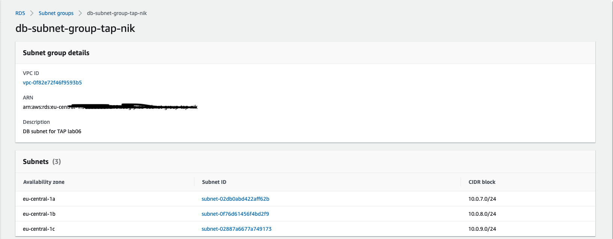
## 2. Create the database:
 - Engine is PostrgreSQL
 - Template Dev/Test
 - Do not create a standby instances
 - Connectivity choose our VPC and the subnect group we created
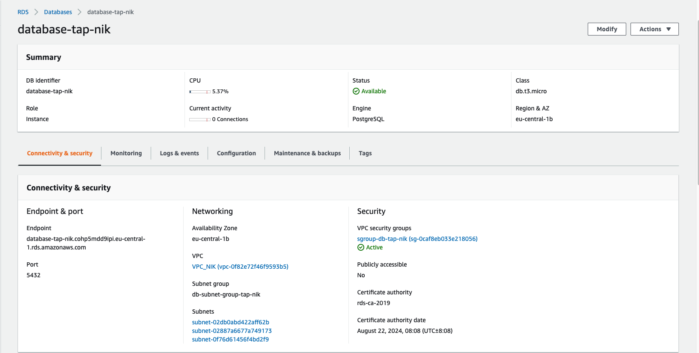
## 3. Create a secret with the password
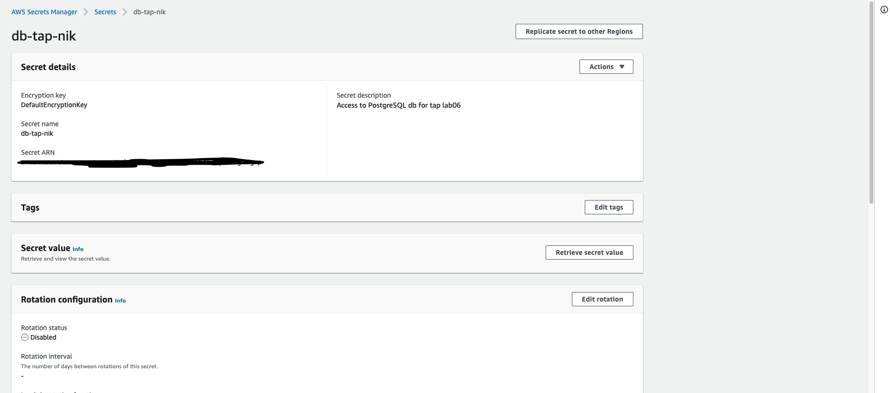

# Create a private EC2 (Internet-accessible). Use user-data to install client software to access the RDS
## 1. We crete EC2 instance:
 - In the private subnet with the NAT
 - We use IAM role so we can use the session manager
 - With following User data:
```bash
sudo amazon-linux-extras install -y postgresql13
```
## 2. We will use psql to login in to the db and list all dbs:
```bash
[ec2-user@ip-10-0-4-54 ~]$ psql --host=database-tap-nik.cohp5mdd9ipi.eu-central-1.rds.amazonaws.com --port=5432 --username=postgres --password
Password:
psql (13.3, server 13.5)
SSL connection (protocol: TLSv1.2, cipher: ECDHE-RSA-AES256-GCM-SHA384, bits: 256, compression: off)
Type "help" for help.

postgres=> \l
                                  List of databases
   Name    |  Owner   | Encoding |   Collate   |    Ctype    |   Access privileges
-----------+----------+----------+-------------+-------------+-----------------------
 postgres  | postgres | UTF8     | en_US.UTF-8 | en_US.UTF-8 |
 rdsadmin  | rdsadmin | UTF8     | en_US.UTF-8 | en_US.UTF-8 | rdsadmin=CTc/rdsadmin+
           |          |          |             |             | rdstopmgr=Tc/rdsadmin
 template0 | rdsadmin | UTF8     | en_US.UTF-8 | en_US.UTF-8 | =c/rdsadmin          +
           |          |          |             |             | rdsadmin=CTc/rdsadmin
 template1 | postgres | UTF8     | en_US.UTF-8 | en_US.UTF-8 | =c/postgres          +
           |          |          |             |             | postgres=CTc/postgres
(4 rows)

postgres=> \q
```
# Create and RDS snapshot
## 1. Go to snapshot and choose our db instance:
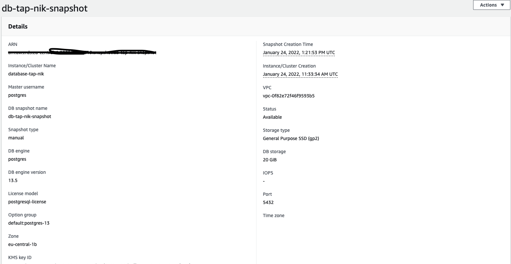
## 2. We coppy our snapshot from Frankfurt region to the Ireland region:
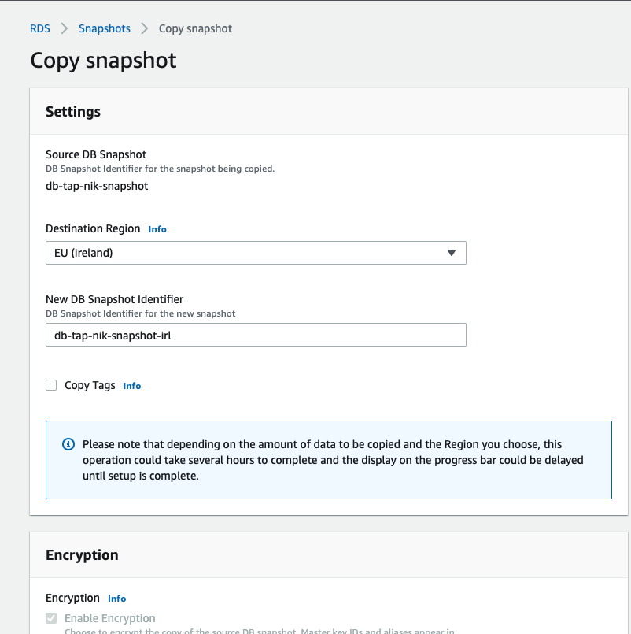
## 3. In Ireland we have vpc and 2 private subnets so we create a subnet group with them:
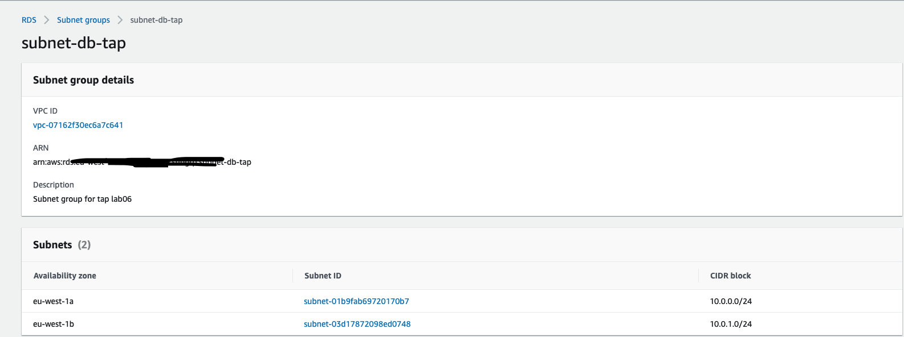
## 4. Now we can restore from our snapshot
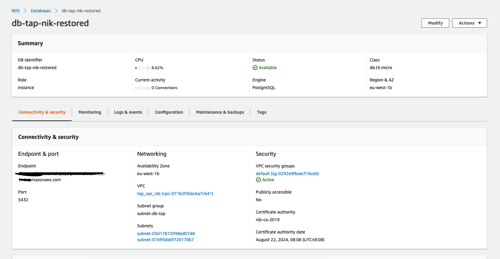

# Create a backup plan with AWS Backup
## 1. Create a Backup plan
 - Backup frequency is every week on Saturday
 - Retention period will be 1 Month
 - Default vault
 - Destination Frankfurt
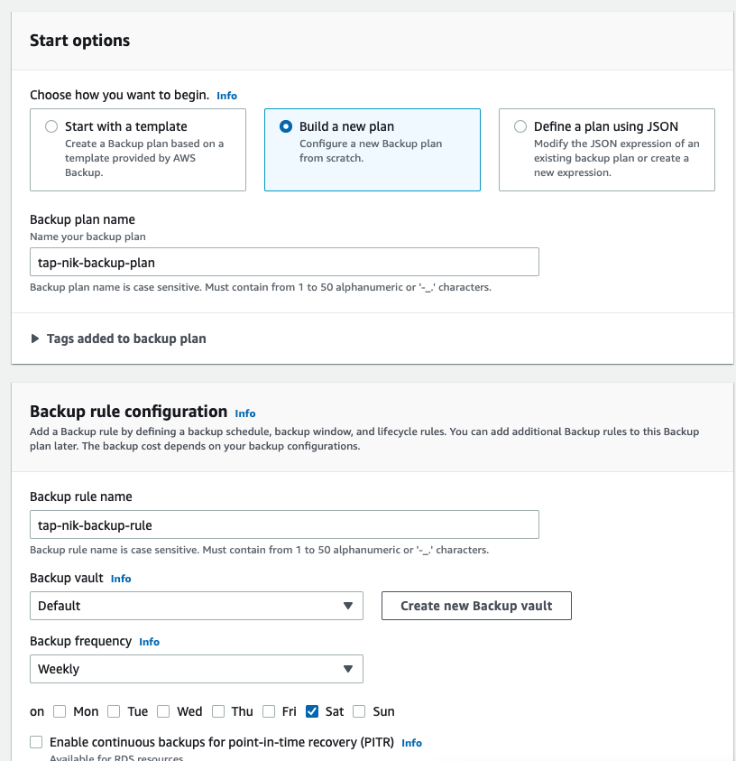
## 2. Assign a resource to our backup plan. Specify our RDS db and will not use tags
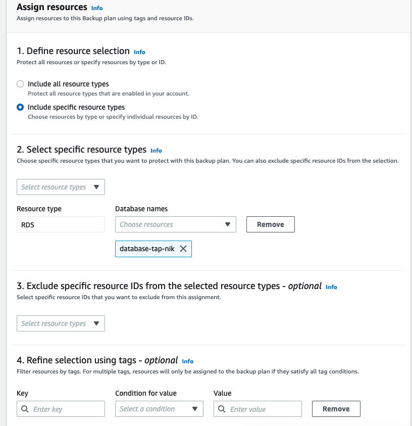

# Modify RDS to Multi-AZ and Create a read replica on another region.
## 1. Modify our RDS db  Availability and durability:
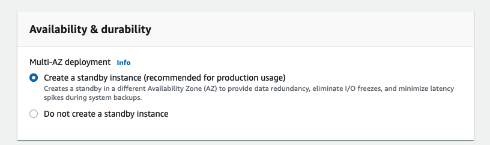
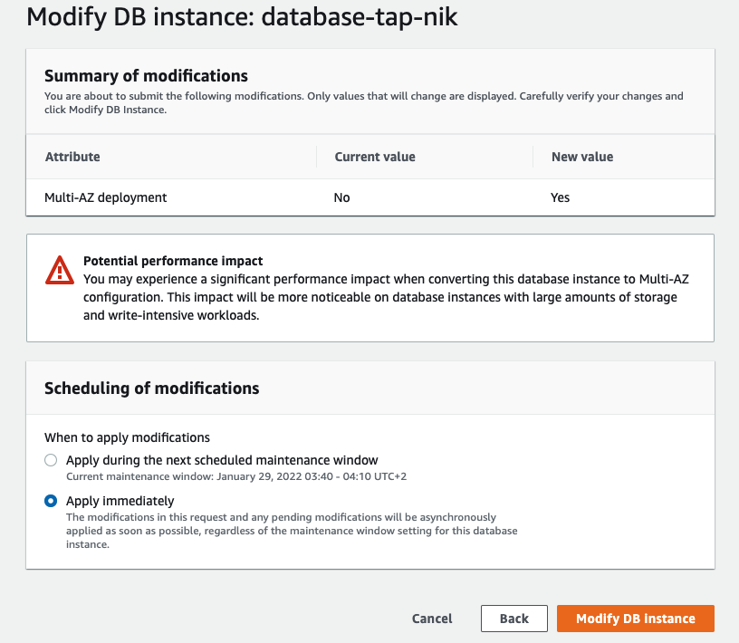
## 2. Create a read replica in another region:
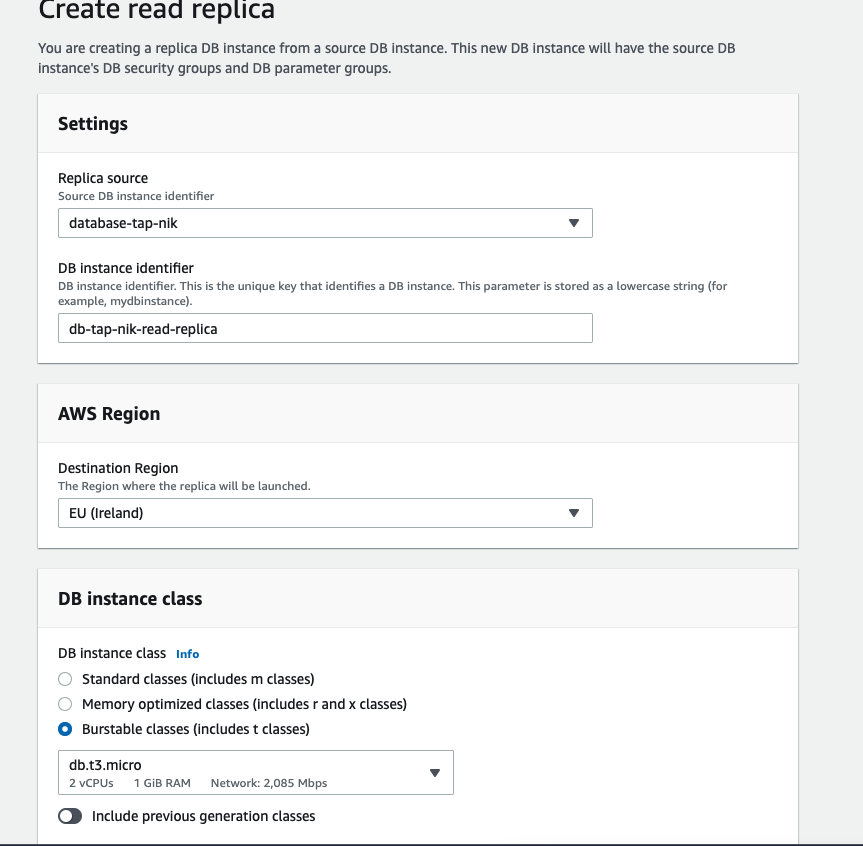
## 3. Our replica is created in the new region
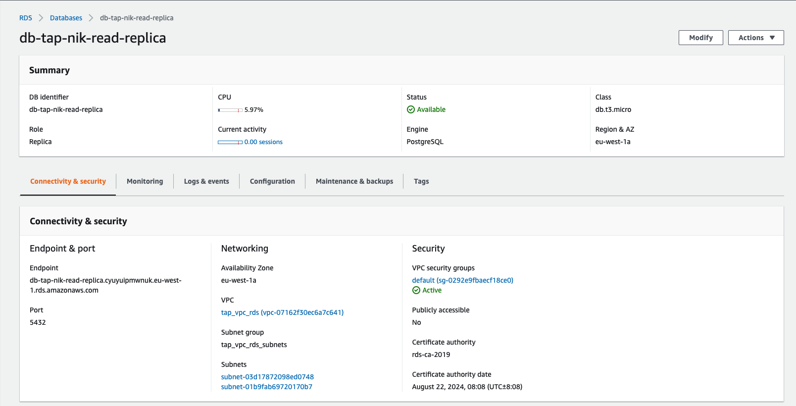
## 4. Promote the replica to a standalone master RDS
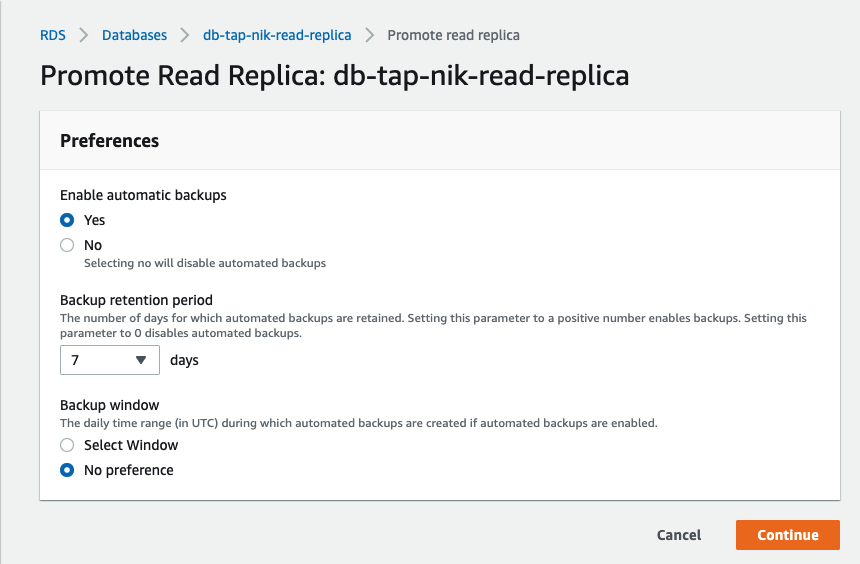
## 4. Now we can see that it is not replica anymore,but Instance
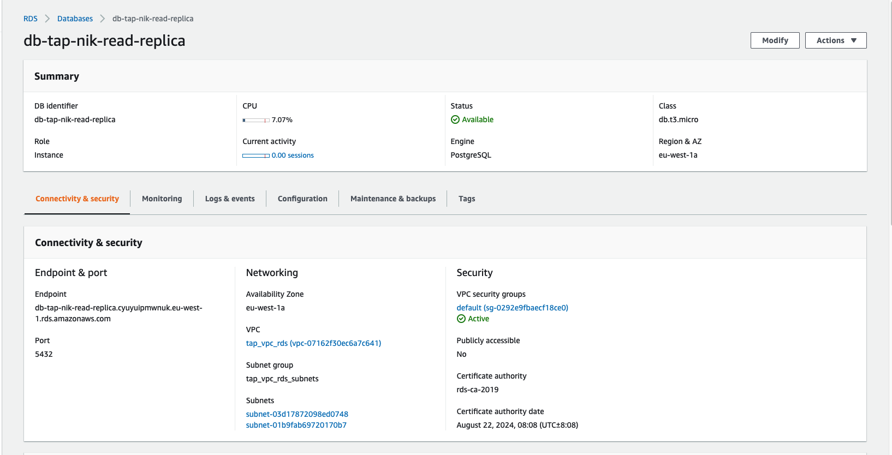

# Optional task connect to RDS using client software on personal laptop
## 1. Install the AWS CLI Session Manager plugin
```bash
~/Downloads$ session-manager-plugin

The Session Manager plugin was installed successfully. Use the AWS CLI to start a session.
```
## 2. Create new Policy and assign to the role which we use for the EC2 instance:
```JSON
{
    "Version": "2012-10-17",
    "Statement": [
        {
            "Effect": "Allow",
            "Action": "ssm:StartSession",
            "Resource": [
                "arn:aws:ec2:eu-central-1:<account number>:*",
                "arn:aws:ssm:*:*:document/AWS-StartSSHSession"
            ]
        }
    ]
}
```
## 3. Now we can connect with ssh via session manager:
```bash
~/Downloads$ ssh -i TAP_NIK.pem ec2-user@i-076b997a7f74cf9f4
The authenticity of host 'i-076b997a7f74cf9f4 (<no hostip for proxy command>)' can't be established.
Last login: Mon Jan 24 19:57:10 2022

       __|  __|_  )
       _|  (     /   Amazon Linux 2 AMI
      ___|\___|___|

https://aws.amazon.com/amazon-linux-2/
[ec2-user@ip-10-0-4-54 ~]$ 
```
## 4. We can make the ssh tunnel
```bash
ssh -i TAP_NIK.pem ec2-user@i-076b997a7f74cf9f4 -L 5432:database-tap-nik.cohp5mdd9ipi.eu-central-1.rds.amazonaws.com:5432
```
## 5. Now we can run locally psql via the tunnel:
```bash
~/Downloads$ psql --username postgres --host 127.0.0.1 --port 5432 --password
Password: 
psql (14.1, server 13.5)
SSL connection (protocol: TLSv1.2, cipher: ECDHE-RSA-AES256-GCM-SHA384, bits: 256, compression: off)
Type "help" for help.

postgres=> \l
                                  List of databases
   Name    |  Owner   | Encoding |   Collate   |    Ctype    |   Access privileges   
-----------+----------+----------+-------------+-------------+-----------------------
 postgres  | postgres | UTF8     | en_US.UTF-8 | en_US.UTF-8 | 
 rdsadmin  | rdsadmin | UTF8     | en_US.UTF-8 | en_US.UTF-8 | rdsadmin=CTc/rdsadmin+
           |          |          |             |             | rdstopmgr=Tc/rdsadmin
 template0 | rdsadmin | UTF8     | en_US.UTF-8 | en_US.UTF-8 | =c/rdsadmin          +
           |          |          |             |             | rdsadmin=CTc/rdsadmin
 template1 | postgres | UTF8     | en_US.UTF-8 | en_US.UTF-8 | =c/postgres          +
           |          |          |             |             | postgres=CTc/postgres
(4 rows)

postgres=> 
```