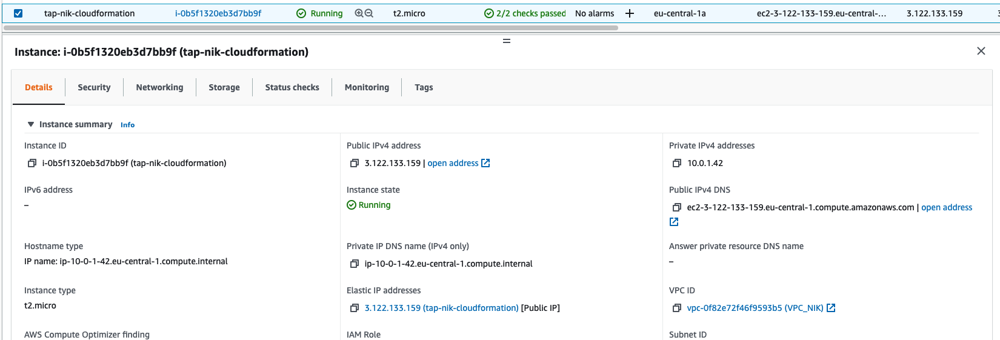
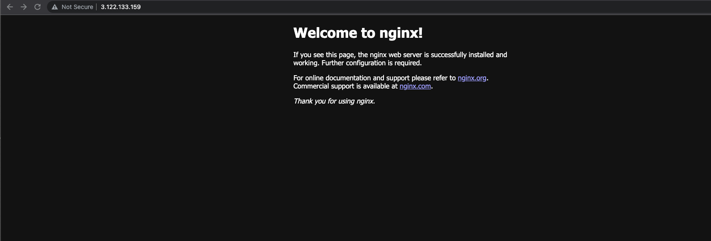

# Create a simple public EC2 instance via CloudFormation
## 1. Create the yml manifest file and upload it to CloudFormation stack
```YAML
AWSTemplateFormatVersion: "2010-09-09"
Description: A sample template
Resources:
  tapnikcloudf:
    Type: "AWS::EC2::Instance"
    Properties: 
      ImageId: "ami-05cafdf7c9f772ad2"
      InstanceType: t2.micro
      KeyName: TAP_NIK
      SecurityGroupIds:
        - sg-07d62022dd91d1566
      SubnetId: subnet-0bdcd34132b2878cd
      UserData:
        Fn::Base64: |
          #!/bin/bash
          sudo amazon-linux-extras install -y docker
          sudo systemctl start docker
          sudo docker run -dp 80:80 nginx:alpine
  tapnikcloud:
    Type: AWS::EC2::EIP
    Properties:
      InstanceId: !Ref tapnikcloudf
```
## 2. We can see that our intance is up:

## 3. Also our docker container is serving as we can see:
