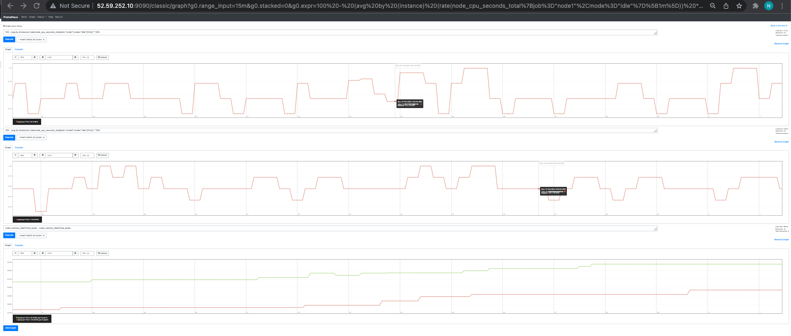
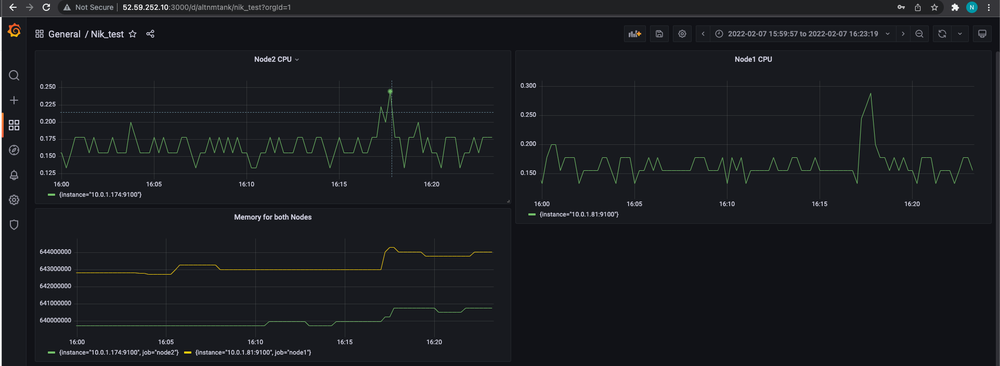
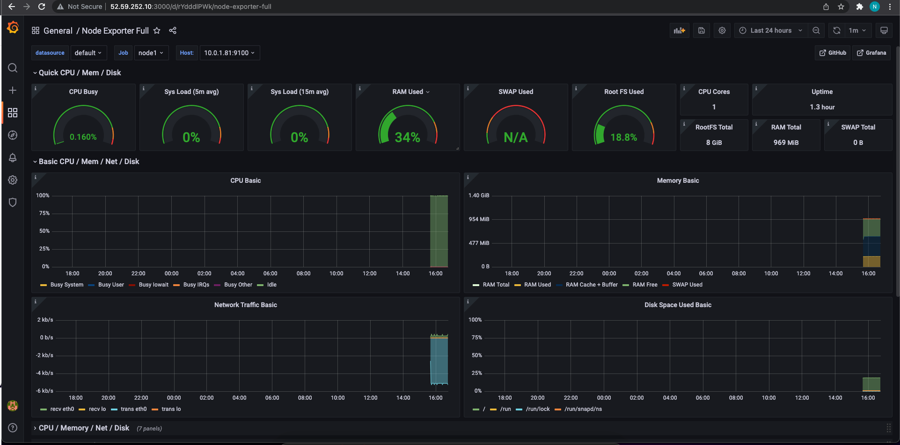

## 1. Provision VPC and 3xEC2 instances with following user data:
### Here are the two nodes we are going to monitor
```
resource "aws_instance" "nodes" {
  count = 2
  ami           = "ami-0d527b8c289b4af7f"
  instance_type = "t2.micro"

  root_block_device {
    volume_type = "gp3"
  }
  user_data =  <<EOF
#!/bin/bash
wget https://github.com/prometheus/node_exporter/releases/download/v1.3.1/node_exporter-1.3.1.linux-amd64.tar.gz
tar xvfz node_exporter-*.*-amd64.tar.gz
rm -f node_exporter-*.*.gz
cd node_exporter-*.*-amd64
./node_exporter
EOF
  subnet_id              = aws_subnet.public.id
  vpc_security_group_ids = [aws_security_group.node.id]

  tags = {
    Name = "tap-nik_node_${count.index + 1}"
  }
}
```
### Here is the node with prometheus and grafana:
```
resource "aws_instance" "obs" {
  ami           = "ami-0d527b8c289b4af7f"
  instance_type = "t2.micro"

  root_block_device {
    volume_type = "gp3"
  }
  key_name               = "TAP_NIK"
  subnet_id              = aws_subnet.public.id
  vpc_security_group_ids = [aws_security_group.obs.id]
  user_data =  <<EOF
#!/bin/bash
wget -q -O - https://packages.grafana.com/gpg.key | sudo apt-key add -
sudo add-apt-repository "deb https://packages.grafana.com/oss/deb stable main"
sudo apt update
sudo apt install -y grafana
sudo systemctl start grafana-server
wget https://github.com/prometheus/prometheus/releases/download/v2.33.1/prometheus-2.33.1.linux-amd64.tar.gz
tar xvf prometheus-*.*-amd64.tar.gz
rm -f prometheus-*.*.gz
cd prometheus-*.*
./prometheus

EOF

  tags = {
    Name = "tap-nik_prometheus"
  }
}
```

## 2. After all instances are up, add two nodes to be monitored by prometheus
```YAML
  - job_name: "node1"

    static_configs:
      - targets: ["10.0.1.81:9100"]

  - job_name: "node2"

    static_configs:
      - targets: ["10.0.1.174:9100"]
```
### Reload the config:
```bash
sudo kill -HUP 2304
```
## 3. Create a graph for the CPU utilization:
```
node 1 = 100 - (avg by (instance) (rate(node_cpu_seconds_total{job="node1",mode="idle"}[1m])) * 100)
node 2 = 100 - (avg by (instance) (rate(node_cpu_seconds_total{job="node2",mode="idle"}[1m])) * 100)
```
## 4. Create a graph for memory utilization
```
node_memory_MemTotal_bytes - node_memory_MemFree_bytes
```

## 5. Create dashboard in grafana

## 6. Use dashboard created by grafana
