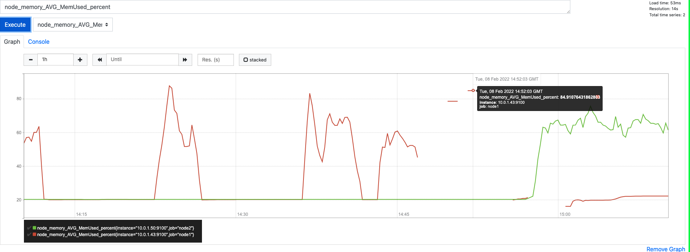
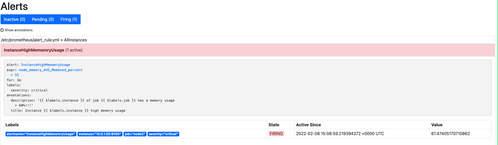
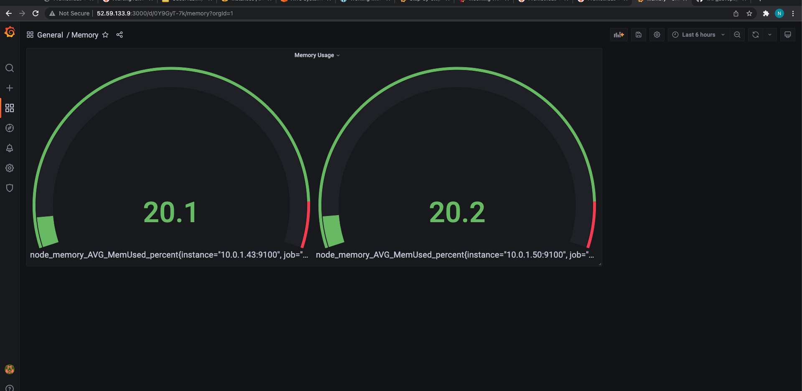
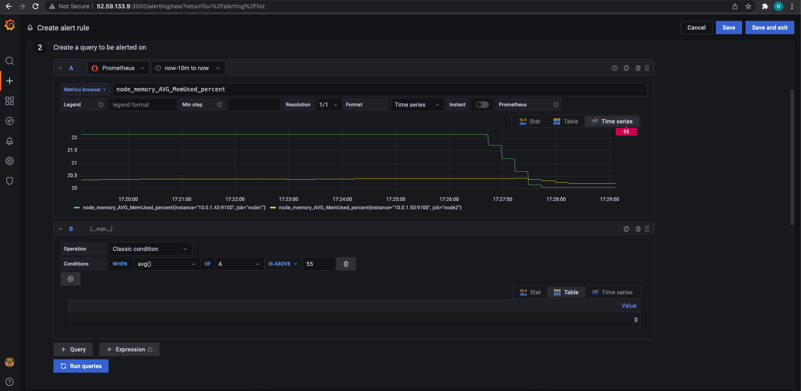
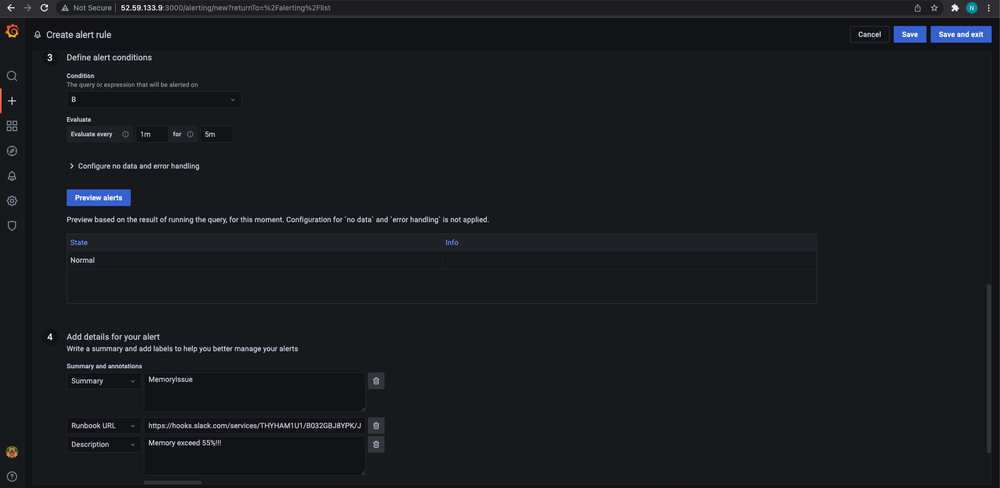
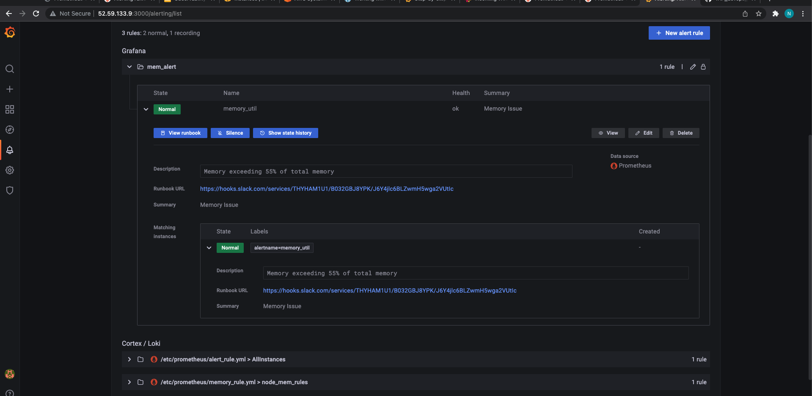

## 1. Create query that should use at least one function and operator:
```
100 * (1 - avg_over_time(node_memory_MemFree_bytes{job!="node"}[5m]) / avg_over_time(node_memory_MemTotal_bytes{job!="node"}[5m]))
```
## 2. Create a Recording rule:
```YML
groups:
  - name: node_mem_rules
    rules:
      - record: node_memory_AVG_MemUsed_percent
        expr: 100 * (1 - (avg_over_time(node_memory_MemFree_bytes{job!="node"}[1m]) + avg_over_time(node_memory_Buffers_bytes{job!="node"}[1m]) + avg_over_time(node_memory_Cached_bytes{job!="node"}[1m])) / avg_over_time(node_memory_MemTotal_bytes{job!="node"}[1m]))
```


## 3. Create Alert rule:
```YML
groups:
- name: AllInstances
  rules:
  - alert: InstanceHighMemomryUsage
    # Condition for alerting
    expr: node_memory_AVG_MemUsed_percent > 55
    for: 1m
    # Annotation - additional informational labels to store more information
    annotations:
      title: 'Instance {{ $labels.instance }} high memory usage'
      description: '{{ $labels.instance }} of job {{ $labels.job }} has a memory usage > 60%!!!'
    # Labels - additional labels to be attached to the alert
    labels:
      severity: 'critical'
```
### We can see our alarm on one of the nodes is firing

## 4. Install alertmanager and set the folling config:
```
sudo apt install -y prometheus-alertmanager
```
```YML
global:
  resolve_timeout: 1m
  slack_api_url: 'https://hooks.slack.com/services/'

route:
  receiver: 'slack-notifications'

receivers:
- name: 'slack-notifications'
  slack_configs:
  - channel: '#tap-devops-2021-for-lambda-testing'
    send_resolved: true
```

## 5. Create dashboard in Grafana:


## 6. Create alert in grafana
 - first we need to create a new folder
 - create the alert
 - create a contact point for the slack
 - make slack contact point as default


