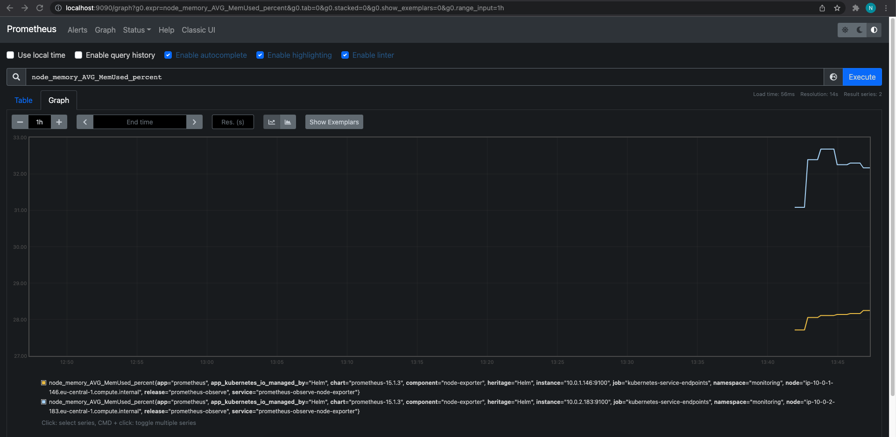
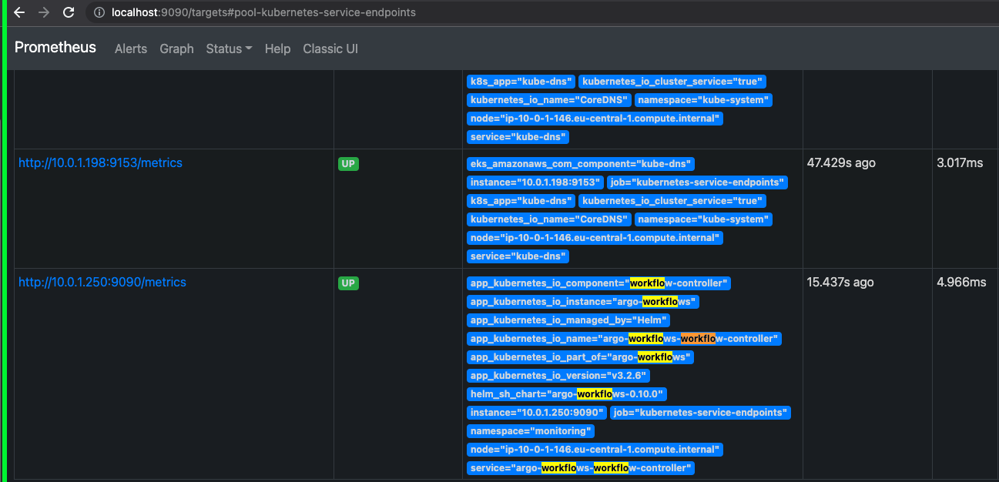
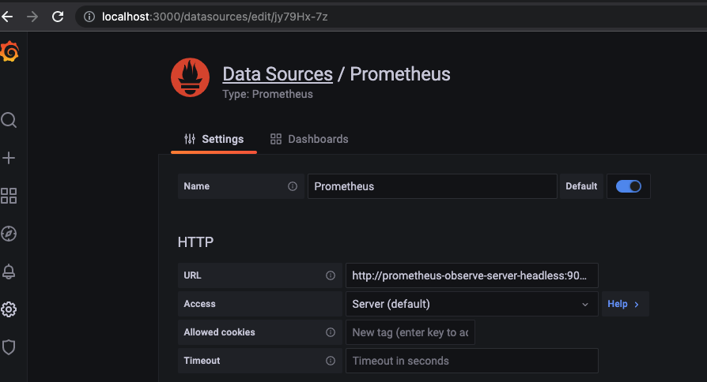
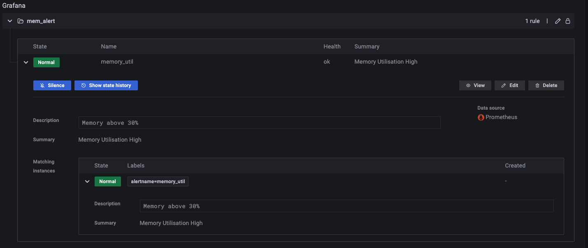

## 1. Created new EKS with two worker nodes.
## 2. Deploy Prometheus via HELM:
 - change the values.yaml as follow:
```YAML
  recording_rules.yml:
    groups:
      - name: node_mem_rules
        rules:
          - record: node_memory_AVG_MemUsed_percent
            expr: 100 * (1 - (avg_over_time(node_memory_MemFree_bytes[1m]) + avg_over_time(node_memory_Buffers_bytes[1m]) + avg_over_time(node_memory_Cached_bytes[1m])) / avg_over_time(node_memory_MemTotal_bytes[1m]))
```
## And for the server and alertmanager will enable statefulset:
```YAML
alertmanager:
  ## If false, alertmanager will not be installed
  ##
  enabled: true
  statefulSet:
    ## If true, use a statefulset instead of a deployment for pod management.
    ## This allows to scale replicas to more than 1 pod
    ##
    enabled: true

server:
  ## Prometheus server container name
  ##
  enabled: true
  statefulSet:
    ## If true, use a statefulset instead of a deployment for pod management.
    ## This allows to scale replicas to more than 1 pod
    ##
    enabled: true
    statefulsetReplica:
      enabled: true
      replica: 1
```
```bash
helm install -f values.yaml -n monitoring prometheus-observe prometheus-community/prometheus
```
## 3. We can see all the deployments:
```bash
~/Work/TAP/observability/lab03$ kubectl get all -n monitoring
NAME                                                         READY   STATUS    RESTARTS   AGE
pod/prometheus-observe-alertmanager-0                        2/2     Running   0          69s
pod/prometheus-observe-kube-state-metrics-57dd464f77-tk6ll   1/1     Running   0          69s
pod/prometheus-observe-node-exporter-px9vz                   1/1     Running   0          69s
pod/prometheus-observe-node-exporter-z4gxp                   1/1     Running   0          69s
pod/prometheus-observe-pushgateway-d68f8c7f9-nzfvc           1/1     Running   0          69s
pod/prometheus-observe-server-0                              2/2     Running   0          69s

NAME                                               TYPE        CLUSTER-IP      EXTERNAL-IP   PORT(S)    AGE
service/prometheus-observe-alertmanager            ClusterIP   172.20.179.49   <none>        80/TCP     70s
service/prometheus-observe-alertmanager-headless   ClusterIP   None            <none>        80/TCP     70s
service/prometheus-observe-kube-state-metrics      ClusterIP   172.20.54.169   <none>        8080/TCP   69s
service/prometheus-observe-node-exporter           ClusterIP   None            <none>        9100/TCP   70s
service/prometheus-observe-pushgateway             ClusterIP   172.20.12.188   <none>        9091/TCP   69s
service/prometheus-observe-server                  ClusterIP   172.20.184.1    <none>        80/TCP     70s
service/prometheus-observe-server-headless         ClusterIP   None            <none>        80/TCP     70s

NAME                                              DESIRED   CURRENT   READY   UP-TO-DATE   AVAILABLE   NODE SELECTOR   AGE
daemonset.apps/prometheus-observe-node-exporter   2         2         2       2            2           <none>          69s

NAME                                                    READY   UP-TO-DATE   AVAILABLE   AGE
deployment.apps/prometheus-observe-kube-state-metrics   1/1     1            1           69s
deployment.apps/prometheus-observe-pushgateway          1/1     1            1           69s

NAME                                                               DESIRED   CURRENT   READY   AGE
replicaset.apps/prometheus-observe-kube-state-metrics-57dd464f77   1         1         1       70s
replicaset.apps/prometheus-observe-pushgateway-d68f8c7f9           1         1         1       70s

NAME                                               READY   AGE
statefulset.apps/prometheus-observe-alertmanager   1/1     70s
statefulset.apps/prometheus-observe-server         1/1     70s
```
## 4. Port forwarding the Prometheus to localhost and we can see our Recording rule:
```bash
kubectl port-forward statefulset.apps/prometheus-observe-server 9090:9090 -n monitoring
```


## 5. Install Argo Workflow
 - modify values.yaml as follow:
```YAML
controller:
  metricsConfig:
    # -- Enables prometheus metrics server
    enabled: true
  serviceType: ClusterIP
  # -- Annotations to be applied to the controller Service
  serviceAnnotations:
    prometheus.io/scrape: "true"
    prometheus.io/path: /metrics
    prometheus.io/port: "9090"
```
```
~/Work/TAP/observability/lab03$ helm install -f argo_value/values.yaml -n monitoring argo-workflows argo/argo-workflows
```

## 6. Install Grafana:
```bash
~/Work/TAP/observability/lab03$ helm install -n monitoring grafana grafana/grafana
~/Work/TAP/observability/lab03$ kubectl port-forward service/grafana 3000:80 -n monitoring
```
### Set the prometheus server

## 7. Created alert in Grafana
