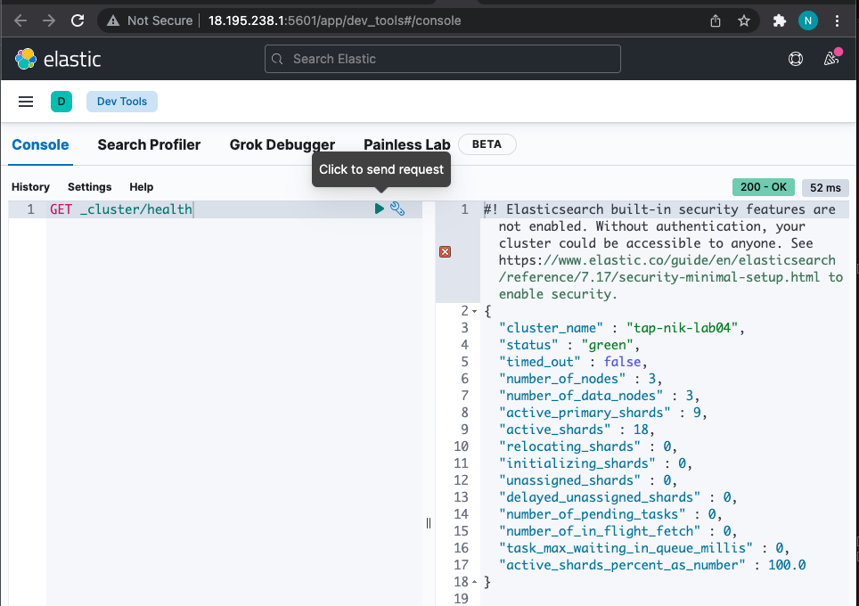
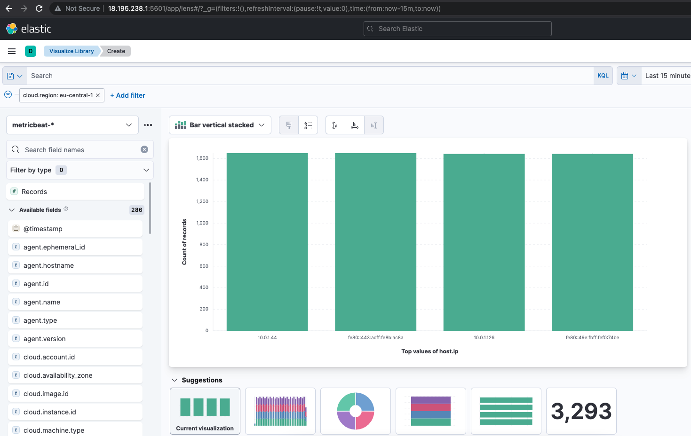

## 1. Edit the /etc/elasticsearch/elasticsearch.yml as follow:
```
cluster.name: tap-nik-lab04
node.name: es-node-1 
node.master: true # For master node
network.host: 10.0.1.164
http.port: 9200
discovery.zen.ping.unicast.hosts: ["10.0.1.164", "10.0.1.126", "10.0.1.44"]
cluster.initial_master_nodes: ["es-node-1"]
node.data: true # Only for data nodes
```
## 2. We can see our cluster with the 3 nodes:
```bash
ubuntu@ip-10-0-1-164:~$ curl 10.0.1.164:9200/_cluster/health?pretty
{
  "cluster_name" : "tap-nik-lab04",
  "status" : "green",
  "timed_out" : false,
  "number_of_nodes" : 3,
  "number_of_data_nodes" : 3,
  "active_primary_shards" : 9,
  "active_shards" : 18,
  "relocating_shards" : 0,
  "initializing_shards" : 0,
  "unassigned_shards" : 0,
  "delayed_unassigned_shards" : 0,
  "number_of_pending_tasks" : 0,
  "number_of_in_flight_fetch" : 0,
  "task_max_waiting_in_queue_millis" : 0,
  "active_shards_percent_as_number" : 100.0
}
```
## 3. Edit /etc/kibana/kibana.yaml as follow:
```
elasticsearch.hosts: ["http://10.0.1.164:9200"]
server.host: "0.0.0.0"
```

## 4. Edit /etc/metricbeat/metricbeat.yml
```
setup.kibana:
  host: "10.0.1.164:5601"
output.elasticsearch:
  # Array of hosts to connect to.
  hosts: ["10.0.1.126:9200", "10.0.1.44:9200"]
```
```
  sudo metricbeat modules enable elasticsearch
```
### Edit /etc/metricbeat/modules.d/elasticsearch.yml:
```
  - module: elasticsearch
  metricsets:
    - node
    - node_stats
  period: 10s
  hosts: ["http://10.0.1.126:9200"]
```
```
sudo metricbeat setup
sudo service metricbeat start
```
## 5. We can see our IPs from metricbeat in Kibana:
