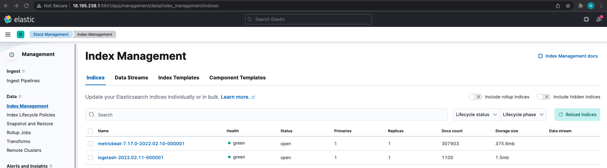
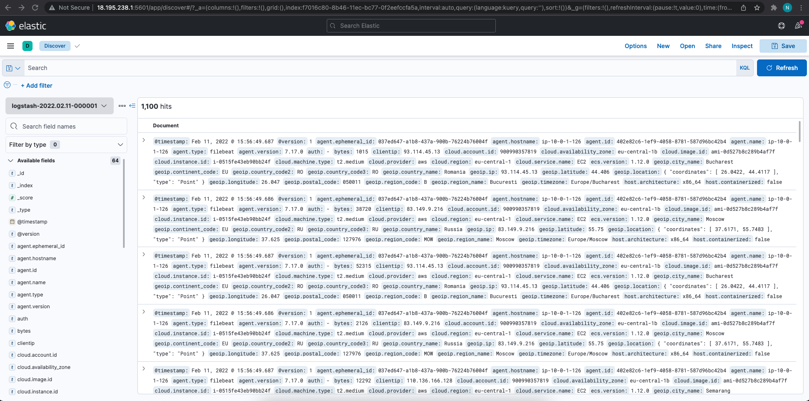

## 1. Logstash is installed on server with IP 10.0.1.164
 - create new file in /etc/logstash/beats-pipeline.conf with following config
 ```
 input {
    beats {
        port => "5044"
    }
}
 filter {
    grok {
        match => { "message" => "%{COMBINEDAPACHELOG}"}
    }
    geoip {
        source => "clientip"
    }
}
output {
    elasticsearch {
        hosts => [ "10.0.1.164:9200" ]
    }
}
```
 - run following command to start the logstash with only one pipeline:
 ```
 sudo /usr/share/logstash/bin/logstash -f /etc/logstash/beats-pipeline.conf --config.reload.automatic
 ```
## 2. Filebeat is installed on server with IP 10.0.1.126
 - path to the log file is:
 ```
 /home/ubuntu/logs/logstash-tutorial.log
 ```
 - edit /etc/filebeat/filebeat.yml as follow
 ```
 filebeat.inputs:
 - type: log
  paths:
    - /home/ubuntu/logs/logstash-tutorial.log
 output.elasticsearch:
  hosts: ["10.0.1.164:5044"]
  ```
 - run following command to start filebeat:
```
filebeat -e -c /etc/filebeat/filebeat.yml -d "publish"
```
## 3. Now we can see the logstash in Kibana


## 4. Created index pattern and we can see it:
