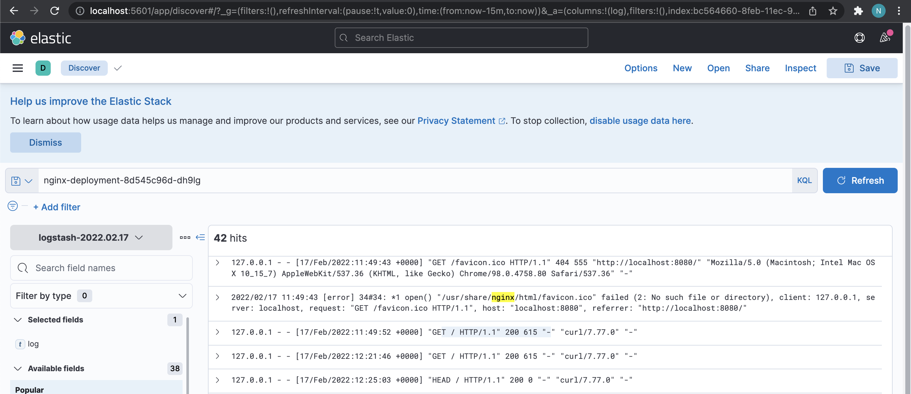

## 1. Logstash is installed on server with IP 10.0.1.164
 - create new file in /etc/logstash/beats-pipeline.conf with following config
 ```
 input {
    beats {
        port => "5044"
    }
}
 filter {
    grok {
        match => { "message" => "%{COMBINEDAPACHELOG}"}
    }
    geoip {
        source => "clientip"
    }
}
output {
    elasticsearch {
        hosts => [ "10.0.1.164:9200" ]
    }
}
```
 - run following command to start the logstash with only one pipeline:
 ```
 sudo /usr/share/logstash/bin/logstash -f /etc/logstash/beats-pipeline.conf --config.reload.automatic
 ```
## 2. Filebeat is installed on server with IP 10.0.1.126
 - path to the log file is:
 ```
 /home/ubuntu/logs/logstash-tutorial.log
 ```
 - edit /etc/filebeat/filebeat.yml as follow
 ```
 filebeat.inputs:
 - type: log
  paths:
    - /home/ubuntu/logs/logstash-tutorial.log
 output.elasticsearch:
  hosts: ["10.0.1.164:5044"]
  ```
 - run following command to start filebeat:
```
filebeat -e -c /etc/filebeat/filebeat.yml -d "publish"
```
## 3. Now we can see the logstash in Kibana


## 4. Created index pattern and we can see it:


# Fluent bit and minikube
## 1. In order to properly support the required persistent volume claims for the Elasticsearch StatefulSet, the default-storageclass and storage-provisioner minikube addons must be enabled.
```
minikube addons enable default-storageclass
minikube addons enable storage-provisioner
```
## 2. Create new namspace:
```
kubectl create namespace elastic
```
## 3. Add elastic repo:
```
helm repo add elastic https://helm.elastic.co
```
## 4. Created custom values.yml as per minikube example:
```YML
---
# Permit co-located instances for solitary minikube virtual machines.
antiAffinity: "soft"

# Shrink default JVM heap.
esJavaOpts: "-Xmx128m -Xms128m"

# Allocate smaller chunks of memory per pod.
resources:
  requests:
    cpu: "100m"
    memory: "512M"
  limits:
    cpu: "1000m"
    memory: "512M"

# Request smaller persistent volumes.
volumeClaimTemplate:
  accessModes: [ "ReadWriteOnce" ]
  storageClassName: "standard"
  resources:
    requests:
      storage: 100M
```
## 5. Install Elasticsearch and Kibana:
```
helm install elasticsearch elastic/elasticsearch -f values.yml -n elastic
helm install kibana elastic/kibana -n elastic
```
## 6. Deploy nginx:
```YML
apiVersion: apps/v1
kind: Deployment
metadata:
  name: nginx-deployment
  namespace: elastic
spec:
  selector:
    matchLabels:
      app: nginx
  replicas: 1 
  template:
    metadata:
      labels:
        app: nginx
    spec:
      containers:
      - name: nginx
        image: nginx:latest
        ports:
        - containerPort: 80
```
```bash
kubectl get all -n elastic
NAME                                   READY   STATUS    RESTARTS   AGE
pod/elasticsearch-master-0             1/1     Running   0          39m
pod/elasticsearch-master-1             1/1     Running   0          39m
pod/elasticsearch-master-2             1/1     Running   0          39m
pod/kibana-kibana-6d56fb6bf9-rs599     1/1     Running   0          12m
pod/nginx-deployment-8d545c96d-nqtgc   1/1     Running   0          74s
```
## 7. Deploy fluentbit as per their guide:
```
kubectl create namespace logging
kubectl create -f https://raw.githubusercontent.com/fluent/fluent-bit-kubernetes-logging/master/fluent-bit-service-account.yaml
kubectl create -f https://raw.githubusercontent.com/fluent/fluent-bit-kubernetes-logging/master/fluent-bit-role.yaml
kubectl create -f https://raw.githubusercontent.com/fluent/fluent-bit-kubernetes-logging/master/fluent-bit-role-binding.yaml
kubectl create -f https://raw.githubusercontent.com/fluent/fluent-bit-kubernetes-logging/master/output/elasticsearch/fluent-bit-configmap.yaml
```
### Change the host as follow
```YML
        - name: FLUENT_ELASTICSEARCH_HOST
          value: "elasticsearch-master.elastic.svc.cluster.local"
```
## 8. We can see our log from fluentbit in Kibana:
