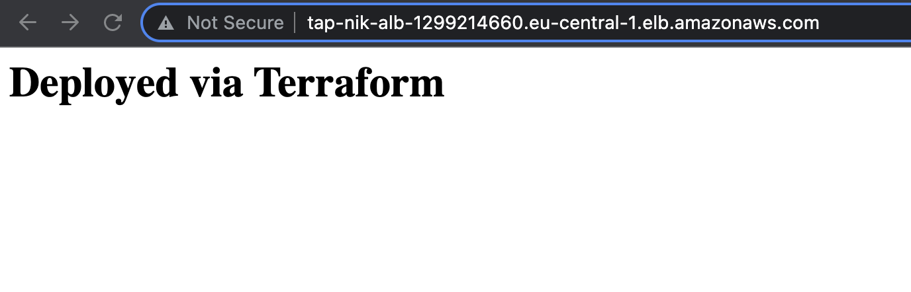

## 1. Create a VPC with at least 2 private subnets with different AZ
```bash
resource "aws_vpc" "this" {
  cidr_block = var.vpc_cidr
  tags = {
    Name = "tap-nik"
  }
}

data "aws_availability_zones" "available" {
  state = "available"
}

resource "aws_subnet" "private" {
  count = 2
  vpc_id                  = aws_vpc.this.id
  cidr_block = "10.0.${count.index}.0/24"
  availability_zone= "${data.aws_availability_zones.available.names[count.index]}"
  tags = {
    Name = "private"
  }
}

resource "aws_subnet" "public" {
  count = 2
  vpc_id                  = aws_vpc.this.id
  cidr_block              = "10.0.${3 + count.index}.0/24"
  availability_zone= "${data.aws_availability_zones.available.names[count.index]}"
  map_public_ip_on_launch = true

  tags = {
    Name = "public"
  }
}
# Create IGW to access the internet
resource "aws_internet_gateway" "this" {
  vpc_id = aws_vpc.this.id

  tags = {
    Name = "tap-nik"
  }
}
# Create Elastic IP for the NAT
resource "aws_eip" "this" {
  vpc      = true
  tags = {
      Name = "tap-nik"
  }
}
# Create the NAT and associate it with one of the public subnets
resource "aws_nat_gateway" "this" {
  allocation_id = aws_eip.this.id
  subnet_id     = aws_subnet.public[0].id

  tags = {
    Name = "tap-nik"
  }

  depends_on = [aws_internet_gateway.this]
}
# Edit the default route table and add the IGW
resource "aws_default_route_table" "this" {
  default_route_table_id = aws_vpc.this.default_route_table_id

  route {
    cidr_block = "0.0.0.0/0"
    gateway_id = aws_internet_gateway.this.id
  }

  tags = {
    Name = "public"
  }
}
# Create route table for the private subnets
resource "aws_route_table" "private" {
  vpc_id = aws_vpc.this.id

  route {
    cidr_block = "0.0.0.0/0"
    nat_gateway_id = aws_nat_gateway.this.id
  }

  tags = {
    Name = "private"
  }
}

resource "aws_route_table_association" "this" {
  subnet_id      = aws_subnet.private[0].id
  route_table_id = aws_route_table.private.id
}

resource "aws_route_table_association" "that" {
  subnet_id      = aws_subnet.private[1].id
  route_table_id = aws_route_table.private.id
}
# Create security group allowing only port 80
resource "aws_security_group" "allow_http" {
  name        = "allow_http"
  description = "Allow HTTP inbound traffic"
  vpc_id      = aws_vpc.this.id

  ingress {
    description = "Allow HTTP"
    from_port   = 80
    to_port     = 80
    protocol    = "tcp"
    cidr_blocks = [var.vpc_cidr]
  }

  egress {
    from_port   = 0
    to_port     = 0
    protocol    = "-1"
    cidr_blocks = ["0.0.0.0/0"]
  }

  tags = {
    Name = "allow_http"
  }
}
```
## 2. Deploy an AutoScalingGroup, SG for the VPC, Use launch configuration for the web servers with an Ubuntu AMI
```bash
# Get the latest Ubuntu AMI
data "aws_ami" "ubuntu" {
  most_recent = true

  filter {
    name   = "name"
    values = ["ubuntu/images/hvm-ssd/ubuntu-*-*-amd64-server-*"]
  }

  filter {
    name   = "virtualization-type"
    values = ["hvm"]
  }

  owners = ["099720109477"] # Canonical
}
# Create a lounch config 
resource "aws_launch_configuration" "this" {
  name_prefix   = "tap-nik-"
  image_id      = data.aws_ami.ubuntu.id
  instance_type = "t2.micro"
  key_name               = var.ssh_key_name
  security_groups = [aws_security_group.allow_http.id]
  root_block_device {
    volume_type = "gp3"
  }
  user_data =  <<EOF
#!/bin/bash
sudo apt update
sudo apt install -y nginx
echo "<h1>Deployed via Terraform</h1>" | sudo tee /var/www/html/index.html
sudo systemctl start nginx

EOF

  lifecycle {
    create_before_destroy = true
  }
}
# Create the autoscaling groupo
resource "aws_autoscaling_group" "bar" {
  name                 = "terraform-asg-example"
  launch_configuration = aws_launch_configuration.this.name
  min_size             = 1
  max_size             = 4
  desired_capacity = 2
  vpc_zone_identifier = [for subnet in aws_subnet.private : subnet.id]
  target_group_arns = [aws_lb_target_group.this.arn]

  lifecycle {
    create_before_destroy = true
  }
}
```
## 3. Create an ALB to distribute traffic across the ASG
```bash
# Create Application load balancer
resource "aws_lb" "this" {
  name               = "tap-nik-alb"
  internal           = false
  load_balancer_type = "application"
  security_groups    = [aws_security_group.alb.id]
  subnets            = [for subnet in aws_subnet.public : subnet.id]

  enable_deletion_protection = true

  tags = {
    Environment = "test"
  }
}
# Create target group
resource "aws_lb_target_group" "this" {
  name     = "tap-nik"
  port     = 80
  protocol = "HTTP"
  vpc_id   = aws_vpc.this.id
}
# Create listener on port 80
resource "aws_lb_listener" "front_end" {
  load_balancer_arn = aws_lb.this.arn
  port              = "80"
  protocol          = "HTTP"

  default_action {
    type             = "forward"
    target_group_arn = aws_lb_target_group.this.arn
  }
}
# New security group allowing port 80 for all IPs
resource "aws_security_group" "alb" {
  name        = "allow_http_alb"
  description = "Allow HTTP inbound traffic"
  vpc_id      = aws_vpc.this.id

  ingress {
    description = "Allow HTTP"
    from_port   = 80
    to_port     = 80
    protocol    = "tcp"
    cidr_blocks = ["0.0.0.0/0"]
  }

  egress {
    from_port   = 0
    to_port     = 0
    protocol    = "-1"
    cidr_blocks = ["0.0.0.0/0"]
  }

  tags = {
    Name = "allow_http"
  }
}
```
## 4. Output the LB DNS name
```bash
output "alb_ip_dns" {
  value = aws_lb.this.dns_name
}
Outputs:

alb_ip_dns = "tap-nik-alb-1299214660.eu-central-1.elb.amazonaws.com"
```
## 5. We can visit the URL:
