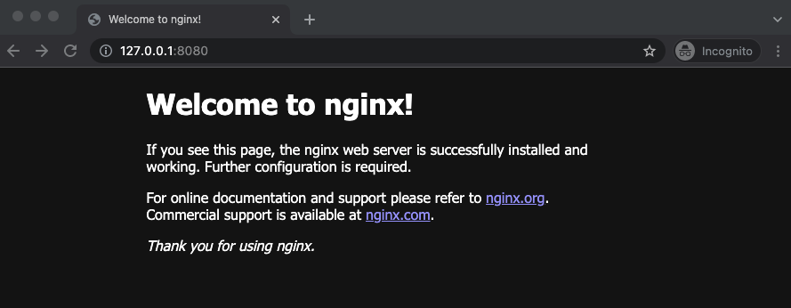

## 1. Create a VPC with vpc module.Create an EKS cluster using the eks module with two self-hosted ‘t3.small’ node.
```YAML
module "vpc" {
  source  = "terraform-aws-modules/vpc/aws"
  version = "3.11.5"

  name = var.name
  cidr = "10.0.0.0/16"

  azs             = ["${var.region}a", "${var.region}b"]
  private_subnets = ["10.0.1.0/24", "10.0.2.0/24"]
  public_subnets  = ["10.0.4.0/24", "10.0.5.0/24"]

  enable_nat_gateway   = true
  single_nat_gateway   = true
  enable_dns_hostnames = true

  tags = {
    "kubernetes.io/cluster/${var.name}" = "shared"
  }

  public_subnet_tags = {
    "kubernetes.io/cluster/${var.name}" = "shared"
    "kubernetes.io/role/elb"              = 1
  }

  private_subnet_tags = {
    "kubernetes.io/cluster/${var.name}" = "shared"
    "kubernetes.io/role/internal-elb"     = 1
  }
}
```
### EKS cluster
```YAML
module "eks" {
  source  = "terraform-aws-modules/eks/aws"
  version = "18.2.7"

  cluster_name                    = var.name
  cluster_version                 = var.cluster_version
  cluster_endpoint_private_access = true
  cluster_endpoint_public_access  = true

  cluster_addons = {
    coredns = {
      resolve_conflicts = "OVERWRITE"
    }
    kube-proxy = {}
    vpc-cni = {
      resolve_conflicts = "OVERWRITE"
    }
  }

  vpc_id     = module.vpc.vpc_id
  subnet_ids = module.vpc.private_subnets

  enable_irsa = true

  create_iam_role = true
  iam_role_use_name_prefix = false
  iam_role_name = "tap-nik-eks-cluster"
  iam_role_additional_policies = ["arn:aws:iam::aws:policy/AmazonEKSClusterPolicy"]

  cluster_security_group_name = "tap-nik-eks-cluster"

  # Extend cluster security group rules
  cluster_security_group_additional_rules = {
    egress_nodes_ephemeral_ports_tcp = {
      description                = "To node 1025-65535"
      protocol                   = "tcp"
      from_port                  = 1025
      to_port                    = 65535
      type                       = "egress"
      source_node_security_group = true
    }
  }

  node_security_group_name = "tap-nik-eks-nodes"
  node_security_group_use_name_prefix = false
  node_security_group_tags = {"kubernetes.io/cluster/${var.name}" = "owned"}

  # Extend node-to-node security group rules
  node_security_group_additional_rules = {
    ingress_self_all = {
      description = "Node to node all ports/protocols"
      protocol    = "-1"
      from_port   = 0
      to_port     = 0
      type        = "ingress"
      self        = true
    }
    egress_all = {
      description      = "Node all egress"
      protocol         = "-1"
      from_port        = 0
      to_port          = 0
      type             = "egress"
      cidr_blocks      = ["0.0.0.0/0"]
      ipv6_cidr_blocks = ["::/0"]
    }
  }

  self_managed_node_groups = {
    
    default_node_group = {

      name            = "tap-nik-self-mng"
      use_name_prefix = false

      subnet_ids = module.vpc.private_subnets

      min_size     = 2
      max_size     = 3
      desired_size = 2

      ami_id               = data.aws_ami.eks_default.id

      pre_bootstrap_user_data = <<-EOT
      export CONTAINER_RUNTIME="containerd"
      export USE_MAX_PODS=false
      EOT

      disk_size     = 20
      instance_type = "t3.small"
      vpc_security_group_ids = [module.eks.node_security_group_id]

      create_iam_role          = true
      iam_role_name            = "tap-nik-eks-nodes"
      iam_role_use_name_prefix = false
      iam_role_description     = "Self managed node group role"
      iam_role_tags = {
        Purpose = "Protector of the kubelet"
      }
      iam_role_additional_policies = [
        "arn:aws:iam::aws:policy/AmazonEC2ContainerRegistryReadOnly",
        "arn:aws:iam::aws:policy/AmazonEKSWorkerNodePolicy",
        "arn:aws:iam::aws:policy/AmazonEKS_CNI_Policy"
      ]

      tags = {
        ExtraTag = "Self managed node group complete example"
      }
    }
  }
}

data "aws_eks_cluster_auth" "this" {
  name = module.eks.cluster_id
}

locals {
  kubeconfig = yamlencode({
    apiVersion      = "v1"
    kind            = "Config"
    current-context = "terraform"
    clusters = [{
      name = module.eks.cluster_id
      cluster = {
        certificate-authority-data = module.eks.cluster_certificate_authority_data
        server                     = module.eks.cluster_endpoint
      }
    }]
    contexts = [{
      name = "terraform"
      context = {
        cluster = module.eks.cluster_id
        user    = "terraform"
      }
    }]
    users = [{
      name = "terraform"
      user = {
        token = data.aws_eks_cluster_auth.this.token
      }
    }]
  })
}

resource "null_resource" "apply" {
  triggers = {
    kubeconfig = base64encode(local.kubeconfig)
    cmd_patch  = <<-EOT
      kubectl create configmap aws-auth -n kube-system --kubeconfig <(echo $KUBECONFIG | base64 --decode)
      kubectl patch configmap/aws-auth --patch "${module.eks.aws_auth_configmap_yaml}" -n kube-system --kubeconfig <(echo $KUBECONFIG | base64 --decode)
    EOT
  }

  provisioner "local-exec" {
    interpreter = ["/bin/bash", "-c"]
    environment = {
      KUBECONFIG = self.triggers.kubeconfig
    }
    command = self.triggers.cmd_patch
  }
}


data "aws_ami" "eks_default" {
  most_recent = true
  owners      = ["amazon"]

  filter {
    name   = "name"
    values = ["amazon-eks-node-${var.cluster_version}-v*"]
  }
}
```
## 2. Use Kubernetes provider to create a namespace into EKS called ‘nginx’.
```YAML
data "aws_eks_cluster" "cluster" {
  name = module.eks.cluster_id
}

data "aws_eks_cluster_auth" "cluster" {
  name = module.eks.cluster_id
}

resource "kubernetes_namespace" "this" {
  metadata {

    labels = {
      app = "nginx"
    }

    name = "nginx"
  }
}
```

## 3. Use Helm provider to install the kubernetes-nginx chart to the nginx namespace. Port-forward nginx to localhost to check if it works.
```YAML
resource "helm_release" "example" {
  name       = "nginx"
  repository = "https://charts.bitnami.com/bitnami"
  chart      = "nginx"
  namespace = "nginx"

  set {
    name  = "service.type"
    value = "ClusterIP"
  }
}
```
```bash
~/Work/TAP/terraform/lab04$ kubectl port-forward service/nginx 8080:80 --namespace=nginx
Forwarding from 127.0.0.1:8080 -> 8080
Forwarding from [::1]:8080 -> 8080
Handling connection for 8080
```
